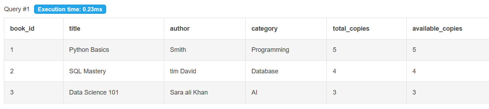
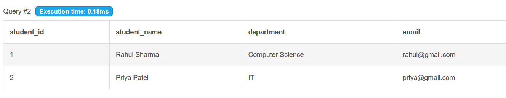
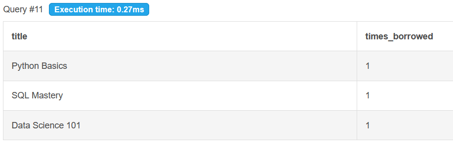
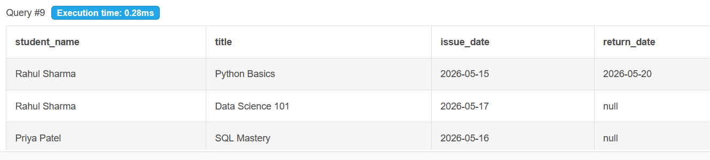

# library-management-sql-system
Built a Library Management SQL System using SQL and MySQL concepts.  Implemented: • Database design • CRUD operations • JOIN queries • Foreign keys • Aggregate functions  This project helped me understand how real-world relational databases work.

## Overview
A beginner-friendly SQL project that manages books, students, and issued books in a library system.

## Features
- Add books
- Add students
- Issue books
- Return books
- Track available copies
- View issued books using JOIN queries

## Technologies Used
- SQL
- MySQL
- DB Fiddle

## SQL Concepts Used
- CREATE TABLE
- INSERT INTO
- SELECT
- UPDATE
- JOIN
- COUNT
- GROUP BY
- ORDER BY
- Foreign Keys

## Project Structure

library-management-sql-system/
│
├── schema.sql
├── queries.sql
├── README.md
└── output/

## Screenshots

### Books Table

### Students Table

### JOIN Query Output

### GroupBy and Count Query

## Author
Simi Dubey
